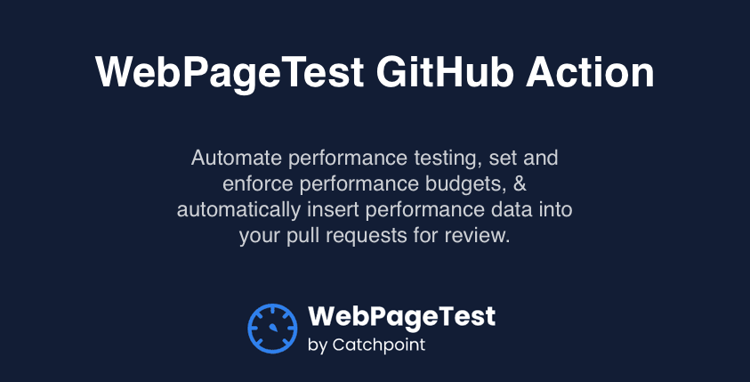

# WebPageTest Github Action
WebPageTest's GitHub Action lets you automatically run tests against WebPageTest on code changes. You can set and enforce performance budgets, and have performance data automatically added to your pull requets to move the performance conversation directly into your existing development workflow.

 